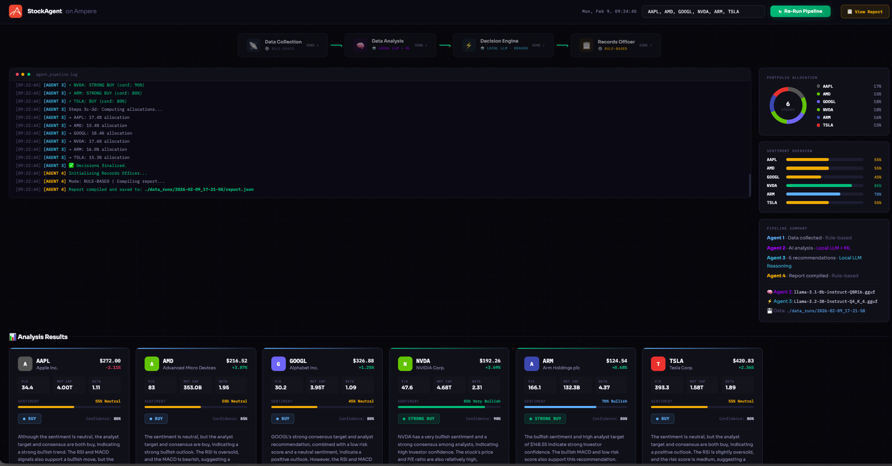
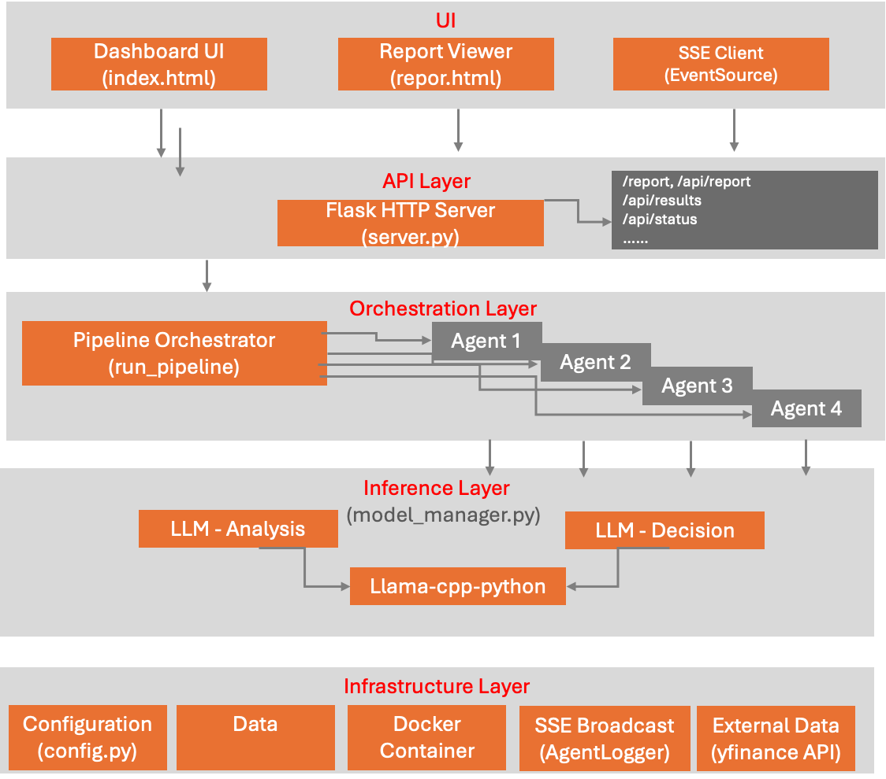
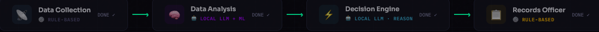

# Stock Agent - Agentic AI

## User Interface - Web Dashboard
StockAgent is a four-agent pipeline that performs stock analysis using local GGUF language models running on CPU via `llama-cpp-python`. The system combines rule-based data collection, LLM powered natural language analysis, ML-based anomaly detection, and deterministic report generation.  
The web dashboard has two pages, both served at http://<your_ip_address>:5005.

### Dashboard
- Ticker input prefilled with AAPL, AMD, GOOGL, NVDA, ARM, TSLA and a Run button that POSTs to /api/run.
- Pipeline strip:  four nodes wired with arrows showing each agent and its current state (IDLE → running → done)
    - Data Collection (rule-based)
    - Data Analysis (local LLM + ML)
    - Decision Engine (local LLM reasoning)
    - Records Officer (rule-based)
- Live terminal: streams log lines from /api/stream (SSE) as the pipeline runs.
- Stat cards: portfolio allocation donut chart, per-ticker sentiment, and pipeline summary card.
- Analysis results: a grid of stock cards showing each ticker’s recommendation, confident gauge, and metrics.

### Report Viewer
- Loaded after a run completes.  Show 3 sections fed by /api/report: Executive Summary, Stock Analysis, and Porttfolio Overview, plus a download button for the raw report.json.

## Architectural Diagram
Below is the architectural diagram which visualize the Stock Agent system from different angles:
- System Overview.
- Four agent pipeline.
- Model management.
- SSE streaming.
- Docker deployment.
- Data flow.
- Dashboard UI layout.
- Report

## What This Demo Shows
This is a multi-agent AI system that analyzes stocks and produces investment recommendations. It demonstrates an agentic AI architecture where four specialized agents work sequentially, each using the optimal approach for its task:

- Agent 1 gathers real-time financial data from Yahoo Finance (no AI involved)
- Agent 2 analyzes that data using a combination of Ampere Optimized Inference model:  llama-3.1-8b-instruct-Q8R16.gguf, and machine learning models,
- Agent 3 synthesizes everything into per-stock recommendations with confidence scores and portfolio allocations using Ampere Optimized Inference model: Llama-3.2-3B-Instruct-Q4_K_4.gguf
- Agent 4 looks at output json files and put together a presentation summary report.
The default ticker set is **AAPL, AMD, GOOGL, NVDA, ARM, TSLA** (but can be configured to any stock symbols).
- All AI inferences run **locally on CPU** using Ampere Optimized Inference AI models in GGUF-format models via llama-cpp-python. No cloud APIs, no GPU required, no per-request costs.

## Target Audience
- Financial and Investment teams or companies:
    - Retails traders.
    - Portfolio managers.
    - Financial analysts.
    - Investment firms.
    -Financial institutes.

## Key Message - What are we trying to convince of?
- Most people still think AI = single LLM inference.  Agentic AI is a real production workload and pipeline which shows:
    - Multiple cooperative agents
    - Decision synthesis
- On premise or Cloud-native deployment with Agentic AI.  Agentic AI can deploy today - economically - in OCI A4.
- CPU only (No need GPU)
- A practical AI platform.

## Proof Points - How does It Show This?
### Agent 1 - Data Collection Agent
- The agent 1 which is **Data Collection agent**  runs 6 sequential steps using the yfinance API:
#### What it fetches
- Current price, previous close, change, market cap, volume, P/E, beta, 52-week high/low
- 1 year of daily OHLCV (Open/High/Low/Close/Volume) data as pandas DataFrames
- Revenue, net income, profit margin, operating margin, debt-to-equity, free cash flow, earnings/revenue growth
- Recent headlines filtered by trusted sources (reuters, cnbc, bloomberg)
- Consensus recommendation, mean/high/low price targets, number of analysts
- Saves everything to data_runs/{timestamp}/

### Agent 2 - Data Analysis Agent
- The agent 2 (**Data Analysis agent**) receives collected_data from Agent 1 and produces enriched analysis.
#### Sentiment Analysis
Method: analyze_sentiment(news_data)
For each ticker, the agent:
- Concatenates all news headlines into a single prompt
- Sends one LLM call asking for a JSON response with sentiment_score (0.0-1.0), sentiment_label, and key_drivers
- Clamps the score to [0.0, 1.0]
- Falls back to {score: 0.5, label: "Neutral"} if the LLM fails
  
The prompt instructs the model to produce a specific JSON schema and explains the scoring scale:
- 0.0 = Very Bearish
- 0.3 = Bearish
- 0.5 = Neutral
- 0.7 = Bullish
- 1.0 = Very Bullish

#### Technical Indicators
Method: compute_technicals(historical)
Computes from historical OHLCV data using pandas:
- **RSI** (Relative Strength Index) -- 14-day rolling gain/loss ratio -- Overbought (>70) or oversold (<30)
- **MACD** (Moving Average Convergence Divergence) -- EMA(12) - EMA(26) vs Signal EMA(9) -- Momentum direction and crossovers
- **Bollinger Band Position** -- Where price sits relative to 20-day SMA +/- 2 std dev -- Relative position in volatility band (0 = lower band, 1 = upper band)

#### Anomaly Detection
Method: detect_anomalies(historical)
Uses scikit-learn's **Isolation Forest** (unsupervised anomaly detection):
- Builds features per day: volume z-score, daily price change, 5-day rolling volatility
- Fits an Isolation Forest with contamination=0.05 (5% expected anomalies)
- Counts anomalies in the last 30 days
- Flags a "breakout signal" if 3+ recent anomalies detected
Requires at least 30 days of history per ticker.

#### Peer Comparison
Method: peer_comparison(prices, fundamentals)
For each ticker, the agent:
- Builds a summary table of all tickers (price, P/E, beta, profit margin, revenue growth)
- Asks the LLM to rank this specific ticker vs its peers on value, growth, risk, and overall
- The LLM returns ranks from 1 (best) to N (worst) plus a key_edge description
Fallback: If the LLM fails, _rule_based_rank() sorts tickers by P/E (value), revenue growth (growth), and beta (risk), then averages the ranks.

#### Risk Scoring
Method: compute_risk_scores(prices, fundamentals, historical)
Computes a composite risk score (1-10) from four normalized metrics.

### Agent 3 - Decision Making Agent
For **each ticker individually**, the agent 3:
- Assembles a data summary: price, P/E, beta, sentiment, RSI, MACD, Bollinger position, risk score, analyst target/consensus
- Sends one LLM call with a chain-of-thought prompt ("Think step by step: 1. Is the sentiment positive? 2. Is RSI overbought?...")
- Requests JSON with: recommendation, confidence, rationale, key_factors, risk_warning
- Validates the recommendation is one of: STRONG BUY, BUY, HOLD, SELL (defaults to HOLD if invalid)
- Clamps confidence to [0, 100]

### Agent 4 - Records Officer Agent
Compiling report and saved to report.json file

